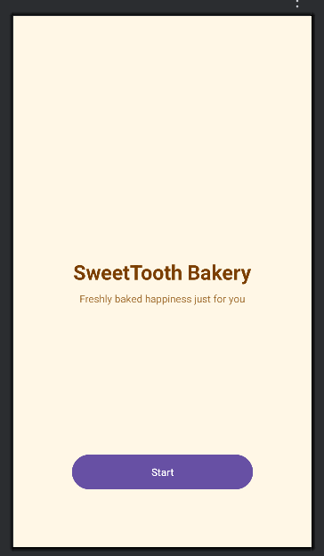
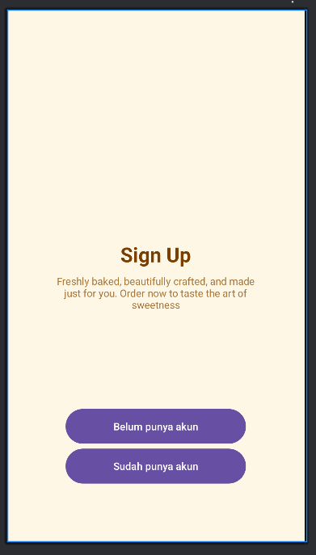
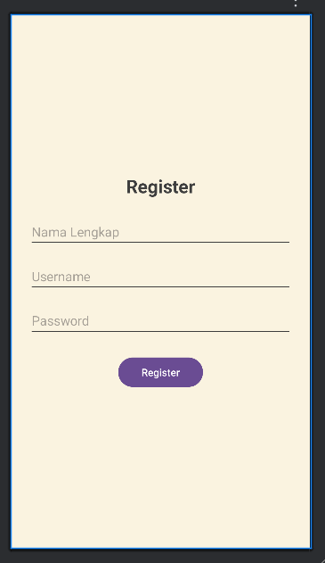
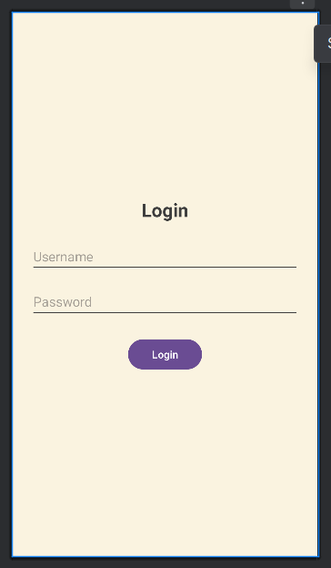
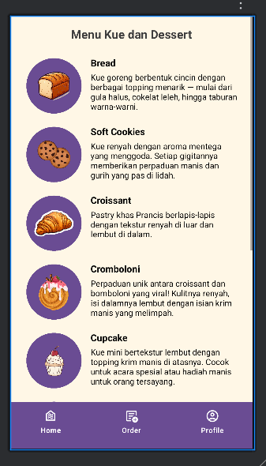
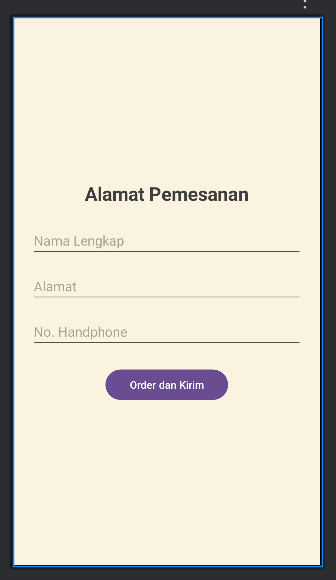
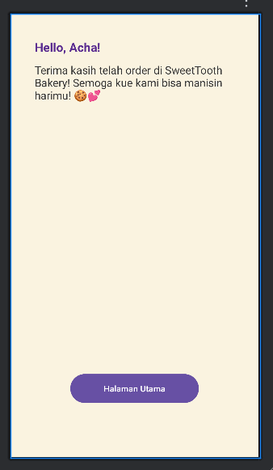

# SweetTooth-Bakery
SweetTooth Bakery adalah aplikasi Android sederhana untuk memesan berbagai kue dan dessert yang tersedia di bakery ini, mulai dari cookies hingga cheesecake. Aplikasi ini memiliki tampilan antarmuka yang interaktif dan mudah digunakan dengan fitur bottom navigation untuk mempermudah berpindah antar halaman.

## Fitur Utama
### Halaman Utama
Halaman ini menampilkan daftar berbagai produk seperti roti, croissant, rollcake, dan dessert lainnya yang dilengkapi dengan gambar dan deskripsi.
### Halaman Order
Halaman ini menampilkan rincian pesanan apa saja produk yang ingin dipesan beserta dengan jumlah pesanannya.
### Navigasi Bawah (Bottom Navigation Bar)
NavBar ini memudahkan pengguna untuk berpindah antar halaman (Home, Order, Profile) secara cepat.

## Tampilan Aplikasi
### Start Page

### Sign Up Page

### Register Page

### Login Page

### Main Page

### Order Page

### Alamat Pemesanan Page

### Closing Page

